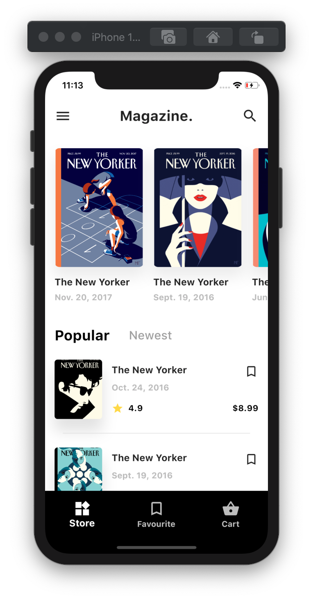
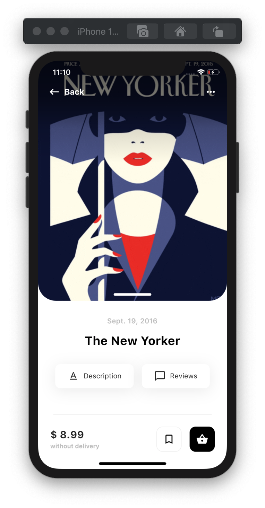

# Flutter Magazine

Online Magazine store design made in Flutter and inspired by Dribble shot by Daniel Moss. [Design Inspiration](https://dribbble.com/shots/6654840-Magazine-Store)

## Screenshots

<table>
  <thead>
    <tr><th align="center">                    Home Screen                </th><th align="center">                    Detail Screen                 </th></tr>
  </thead>
  <tbody>
    <tr><td align="center">  </td><td align="center">  </td></tr>
  </tbody>
</table>

## Installation

**Step 1:**

Download or clone this repo by using the link below:

```bash
https://github.com/csi-vitpune/FlutterMagazine.git
```

**Step 2:**

Go to project root and execute the following command in console to get the required dependencies: 

```bash
flutter pub get 
```

**Step 3:**

Attach android or iOS device and execute following command: 

```bash
flutter run 
```

## Project Structure

```
FlutterMagazine/
|- android
|- assets/poster
|- build
|- ios
|- lib
   |- screens
   |- widgets
|- test
```

## Contributing
Pull requests are welcome. For major changes, please open an issue first to discuss what you would like to change.

##  Contribution

**Step 1:**

Fork Repository

```bash
Click on the Fork
```

**Step 2:**

Clone Forked repository Repository

```bash
git clone [Forked Repo link]
```

**Step 3:**

Make Necessary Changes

**Step 4:**

Syncing a Forked Repository with Upstream

```bash
git remote add upstream https://github.com/csi-vitpune/FlutterMagazine.git
git fetch upstream
git checkout master
git merge upstream/master
```

**Step 5:**

Push Changes to Forked Repository

```bash
git push
```

**Step 6:**

Create Merge Request

```bash
By navigating to Create New Merge request
```

